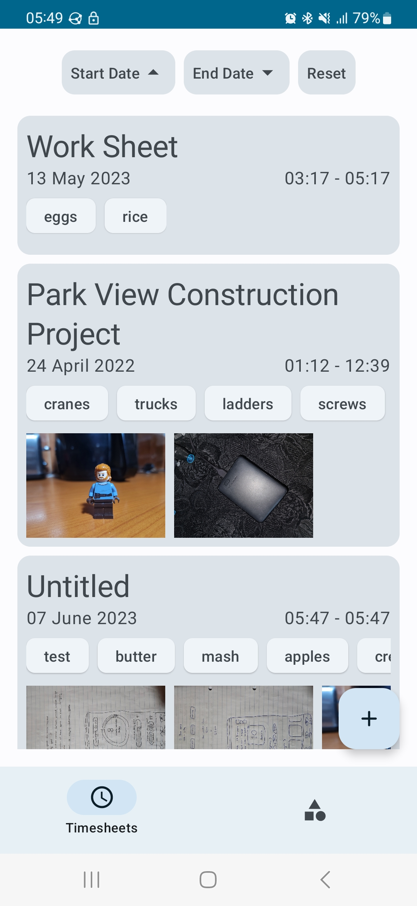
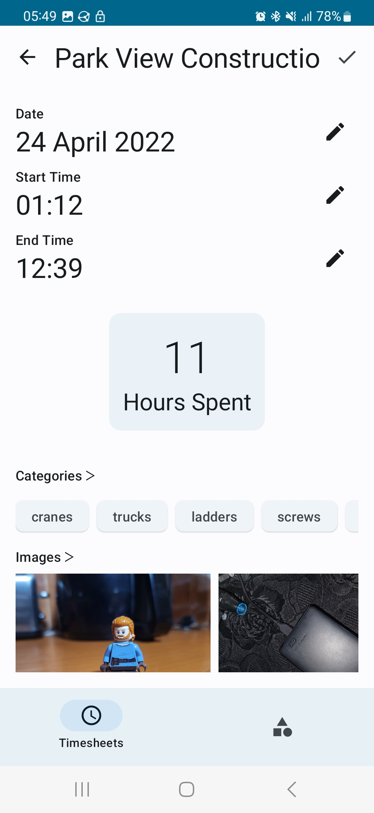
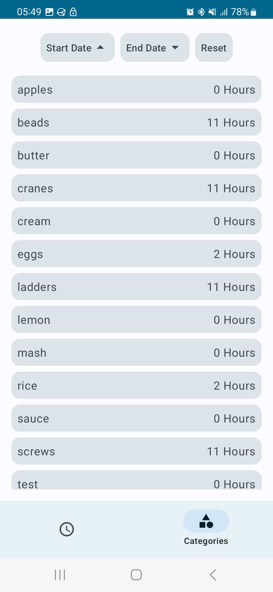

# Timesheet Tracker
This is a timesheet tracker app built using Jetpack Compose for OPSC7311.

# Group Details
```
Rial Seebran ST10083702@vcconnect.edu.za
Ricaylin Ramsamy ST10083902@vcconnect.edu.za
```

The login details are
```
Username: rial
Password: 123
```

# Features
- Track your timesheets
- Filter your timesheets by a date range
- Clean UI
- Sort your timesheets with categories and filter those too!

# Screenshots

Home Screen List


Edit a timesheet


View how long you've spent on a category


# Getting Started
To get started with this project, follow these steps:

- Clone this repository
- Open the project in Android Studio
- Build and run the project on an emulator or physical device

# Dependencies
This project uses the following dependencies:
- Jetpack Compose UI Toolkit
- ViewModel and LiveData
- Material Design Components

# License
This project is licensed under the MIT License.
